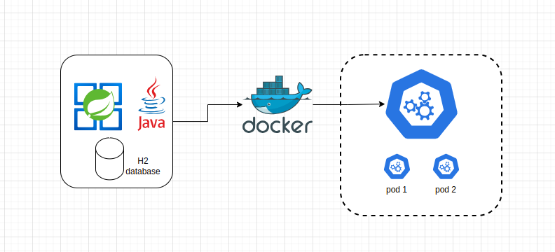

# API challenge-backend-books
Challeng book's backend implementation

## Project's Architecture

### Goals
    - Control of book's operations

### Instructions

Before install:

`Java (JDK 21): https://www.oracle.com/java/technologies/javase/jdk21-archive-downloads.html`

`Docker: https://docs.docker.com/`

`Kubernetes and Minikube (only deploy k8s cluster): https://kubernetes.io/docs/setup/`

### Swagger

`http://<deploy-ip>/swagger-ui/index.html`

### Calls

### Return a book's list by filter (title and publishingCompany)

`GET http://<deploy-ip>:8090/book?title=teste&publishingCompany=teste`

### Save/update a book

- Case update, should set id not null

`POST http://<deploy-ip>:8090/book`

Body (save)

`{
"title": "Título",
"publishingCompany": "Editora",
"edition": 2,
"publishYear": "2024",
"price": 70.0,
"subjects": [1,2],
"writers": [1]
}`

Body (update)

`{
"id": 1,
"title": "Título",
"publishingCompany": "Editora",
"edition": 2,
"publishYear": "2024",
"price": 70.0,
"subjects": [1,2],
"writers": [1]
}`

### Return a book's list base64 to convert PDF

`GET http://<deploy-ip>:8090/book/pdf?title=teste&publishingCompany=teste`

### Return a book by id

`GET http://<deploy-ip>:8090/book/1`

### Delete a book

`DELETE http://<deploy-ip>:8090/book/1`

### Deploy Kubernetes

Init Kubernetes Tool

`minikube start`

`minikube dashboard`

API Books

`cd api-backend-books`

`cd k8s`

`kubectl apply -f .`

`kubectl get svc`

`minikube service api-backend-books`

After last command, do:

`http://<ip-generated-local>:31000/swagger-ui/index.html` (Swagger)

`http://<ip-generated-local>:31000/book?title=teste&publishingCompany=teste` (GET)

`http://<ip-generated-local>:31000/book` (POST)

`http://<ip-generated-local>:31000/book/1` (GET)

`http://<ip-generated-local>:31000/book/1` (DELETE)

### Kubernetes Cluster

HPA (Horizontal Pod Autoscaling)

`The HPA was used with the execution of two instances aiming at performance and anticipating problems with availability and performance.`
